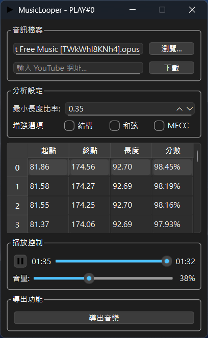

# MusicLooper

A Python-based program for automatically finding the best loop points to achieve seamless music looping. Provides an easy-to-use graphical user interface.

[English](#music-looper) | [中文說明](#music-looper-中文說明)

<p align="center"></p>

<table>
<tr>
<td width="60%">

### Features:

- Find loop points in any audio file (if they exist)
- Support for most common audio formats (MP3, OGG, FLAC, WAV)
- Seamless audio playback using automatically discovered loop points
- Intuitive graphical interface for previewing and selecting loop points
- Real-time loop preview
- Export loop points as metadata tags to audio files

</td>
<td width="40%">
<p align="center"></p>
</td>
</tr>
</table>

## Prerequisites

Music-Looper requires the following software to run:

- [Python (64-bit)](https://www.python.org/downloads/) = 3.12.x
- [Git](https://git-scm.com/downloads) (for downloading source code)
- [FFmpeg](https://ffmpeg.org/download.html) (for audio processing)

Supported audio formats include: WAV, FLAC, Ogg/Vorbis, Ogg/Opus, MP3.
Full list can be found at [libsndfile supported formats page](https://libsndfile.github.io/libsndfile/formats.html)

## Installation Steps

1. **Download Source Code**
   ```sh
   # Clone the repository using git
   git clone https://github.com/AllexaT/Music-Looper.git
   
   # Enter project directory
   cd MusicLooper
   ```

2. **Create Virtual Environment** (Optional but recommended)
   ```sh
   # Create new virtual environment
   python -m venv MusicLooper
   
   # Activate virtual environment
   # Windows:
   MusicLooper\Scripts\activate
   # macOS/Linux:
   source MusicLooper/bin/activate
   ```

3. **Install Required Packages**
   ```sh
   # Install all required packages using pip
   pip install -r requirements.txt
   ```
4. **FFmpeg Setup**
If FFmpeg is not installed:
1. Download [FFmpeg](https://ffmpeg.org/download.html)
2. Place FFmpeg files in `MusicLooper/ffmpeg/bin/` directory
```
MusicLooper/
└── ffmpeg/
    └── bin/
        ├── ffmpeg.exe
        └── ffprobe.exe
```

## Running the Program

After installation, you can run the program by:

1. **Execute `__main__.py` directly**
   ```sh
   # Run from project root directory
   python pymusiclooper/__main__.py
   ```

## Usage Guide

### Main Features

1. **Load Audio Files**
   - Click "Browse..." button to select audio files
   - Or enter a YouTube URL.
   - Supported formats: MP3, WAV, FLAC, OGG

2. **Find Loop Points**
   - Program automatically analyzes and finds the best loop points after loading
   - Use sliders to manually adjust loop point positions
   - Real-time loop preview
   - Sort loop points by score or music length
   - Higher scores indicate more natural loop transitions

3. **Playback Controls**
   - Play/Pause: Use play button to control
   - Loop Mode: Always auto-loop
   - Volume Control: Adjust volume using slider
   - Progress Display: Shows current playback position and total duration

4. **Export Functions**
   - Save selected loop points as audio file metadata tags
   - Exported files retain original filename with added markers

### Advanced Options

- **Loop Length Limits**: 
  - Set minimum and maximum loop lengths
  - Default minimum length is 35% of total track duration
  - Adjusting these parameters helps find more suitable loop points

### Usage Tips

1. **Selecting Best Loop Points**:
   - Observe scores: Higher scores indicate more ideal loop points
   - Use preview function: Verify if loop transitions sound natural
   - Try different loop points to find the most suitable one

2. **Audio File Quality**:
   - Recommend using lossless formats (like WAV, FLAC) for best results
   - Higher quality audio files make it easier to find good loop points

## Troubleshooting

If you encounter issues:
1. Verify Python version is 3.12.x
2. Confirm all required packages are properly installed
3. Check if audio file format is supported
4. Ensure virtual environment is activated (if using)

## Acknowledgments

Thanks to [ARKROW](https://github.com/ARKROW) for their contribution to this project. They laid important groundwork for this project. Their creativity and effort enabled this project to come to life and develop.

## Version History

Available in [CHANGELOG.md](CHANGELOG.md)

---

# Music-Looper 中文說明

這是一個基於 Python 的程式，用於自動尋找最佳的循環點以實現無縫音樂循環播放。提供簡單易用的圖形使用者介面。

<p align="center"></p>
<table>
<tr>
<td width="60%">

### 功能特點：

- 在任何音訊檔案中尋找循環點（如果存在的話）
- 支援最常見的音訊格式（MP3、OGG、FLAC、WAV）
- 使用自動發現的循環點實現無縫音訊播放
- 直觀的圖形介面，用於預覽和選擇循環點
- 即時循環預覽
- 將循環點作為中繼資料標籤匯出到音訊檔案
</td>
<td width="40%">
<p align="center"></p>
</td>
</tr>
</table>

## 系統需求

Music-Looper 需要以下軟體才能運行：

- [Python (64位元)](https://www.python.org/downloads/) = 3.12.x
- [Git](https://git-scm.com/downloads)（用於下載原始碼）
- [FFmpeg](https://ffmpeg.org/download.html)（用於音訊處理）

支援的音訊格式包括：WAV、FLAC、Ogg/Vorbis、Ogg/Opus、MP3。
完整清單可在 [libsndfile 支援格式頁面](https://libsndfile.github.io/libsndfile/formats.html) 找到

## 安裝步驟

1. **下載原始碼**
   ```sh
   # 使用 git 複製儲存庫
   git clone https://github.com/AllexaT/Music-Looper.git
   
   # 進入專案目錄
   cd MusicLooper
   ```

2. **建立虛擬環境**（可選但建議）
   ```sh
   # 建立新的虛擬環境
   python -m venv MusicLooper
   
   # 啟動虛擬環境
   # Windows:
   MusicLooper\Scripts\activate
   # macOS/Linux:
   source MusicLooper/bin/activate
   ```

3. **安裝必要套件**
   ```sh
   # 使用 pip 安裝所有必要套件
   pip install -r requirements.txt
   ```

4. **FFmpeg 設定**
如果尚未安裝 FFmpeg：
1. 下載 [FFmpeg](https://ffmpeg.org/download.html)
2. 將 FFmpeg 檔案放在 `Data/ffmpeg/bin/` 目錄中
```
MusicLooper/
└── ffmpeg/
    └── bin/
        ├── ffmpeg.exe
        └── ffprobe.exe
```

## 執行程式

安裝完成後，您可以透過以下方式執行程式：

1. **直接執行 `__main__.py`**
   ```sh
   # 在專案根目錄執行
   python pymusiclooper/__main__.py
   ```

## 使用指南

### 主要功能

1. **載入音訊檔案**
   - 點擊「瀏覽...」按鈕選擇音訊檔案
   - 或輸入YouTube網址
   - 支援格式：MP3、WAV、FLAC、OGG

2. **尋找循環點**
   - 程式在載入後會自動分析並尋找最佳循環點
   - 使用滑桿手動調整循環點位置
   - 即時循環預覽
   - 依分數或音樂長度排序循環點
   - 分數越高表示循環轉換越自然

3. **播放控制**
   - 播放/暫停：使用播放按鈕控制
   - 循環模式：始終自動循環
   - 音量控制：使用滑桿調整音量
   - 進度顯示：顯示當前播放位置和總時長

4. **匯出功能**
   - 將選定的循環點儲存為音訊檔案的中繼資料標籤
   - 匯出的檔案保留原始檔名並添加標記

### 進階選項

- **循環長度限制**：
  - 設定最小和最大循環長度
  - 預設最小長度為總曲目時長的 35%
  - 調整這些參數有助於找到更合適的循環點

### 使用技巧

1. **選擇最佳循環點**：
   - 觀察分數：分數越高表示循環點越理想
   - 使用預覽功能：確認循環轉換是否自然
   - 嘗試不同循環點以找到最合適的一個

2. **音訊檔案品質**：
   - 建議使用無損格式（如 WAV、FLAC）以獲得最佳結果
   - 較高品質的音訊檔案更容易找到好的循環點

## 疑難排解

如果遇到問題：
1. 確認 Python 版本是 3.12.x
2. 確認所有必要套件都已正確安裝
3. 檢查音訊檔案格式是否受支援
4. 確保虛擬環境已啟動（如果使用）

## 致謝

感謝 [ARKROW](https://github.com/ARKROW) 對這個專案的貢獻。他們為這個專案奠定了重要的基礎。他們的創意和努力使這個專案得以實現和發展。

## 版本歷史

詳見 [CHANGELOG.md](CHANGELOG.md)
